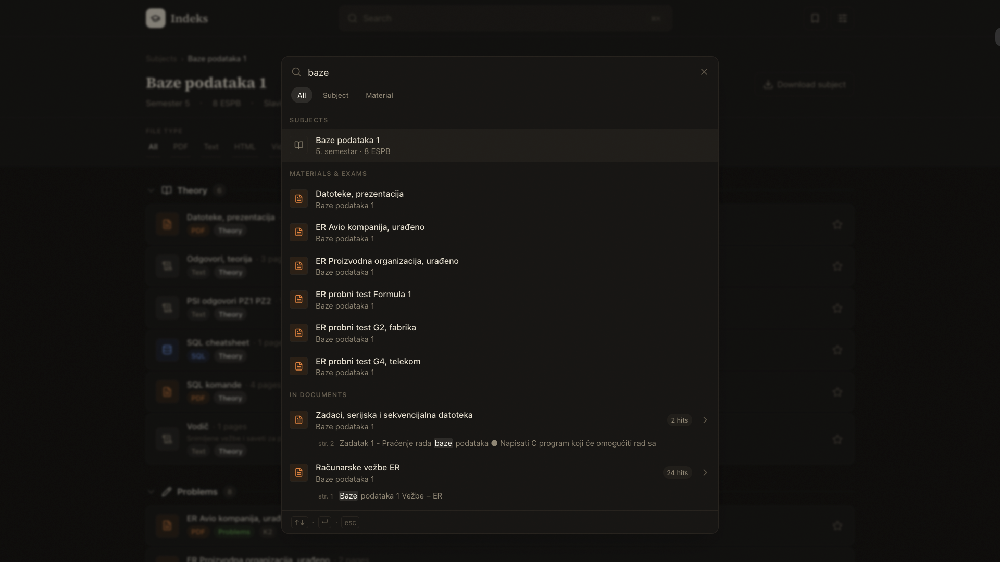
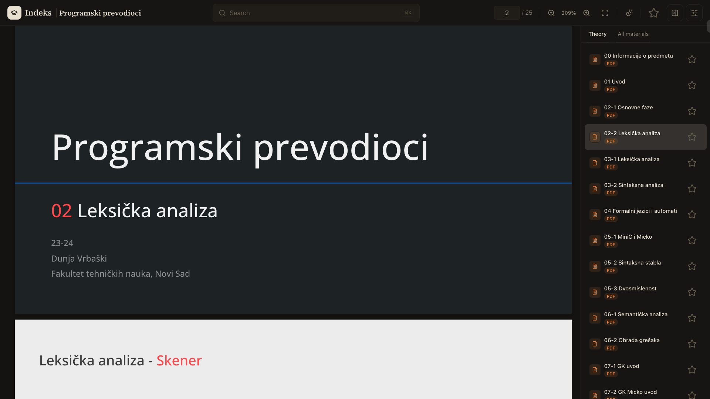
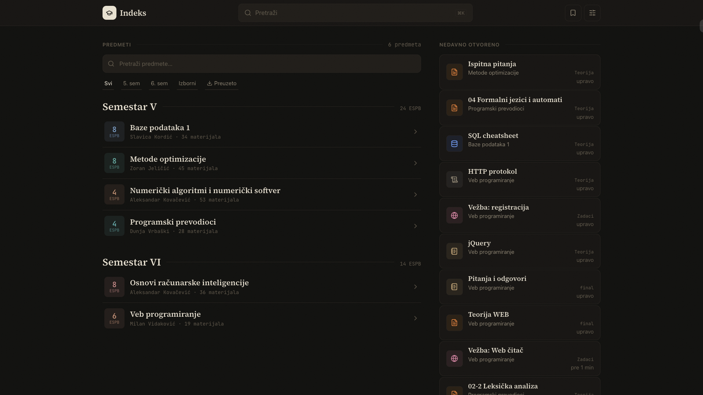

<p align="center">
  <a href="https://ftn-index.bojan-dev.workers.dev/">
    
    <br>
    <strong>Indeks</strong>
  </a>
</p>

<p align="center">
  
  
  
  
  
  
</p>

<p align="center">
  <strong>Study materials, exams, and schedules for Applied Computer Science at FTN Novi Sad, all in one place.</strong>
</p>

FTN study materials are scattered across a dozen Drive folders, exam dates live on the faculty site (if you can find them), and every subject has its own system. Indeks wraps it all into a single searchable interface that gets you to the right document in seconds.

---

## Screenshots


<p align="center"><em>One search across subjects, materials, and inside documents.</em></p>


<p align="center"><em>Reader that renders real content fast, with find-in-document and offline downloads.</em></p>


<p align="center"><em>Six subjects across two semesters.</em></p>

---

## Subjects by semester

The home page groups every subject under its semester in Roman numerals with a running ESPB total. Each row shows the professor, the material count, and whether the subject is downloaded for offline reading. Semester, elective, and downloaded filters plus fuzzy search narrow the list instantly.

Inside a subject, materials group the way students actually think: theory, exercises, and one shelf per exam sitting (K1, K2, final). Exercises with code companions render as single Vežba blocks, so the zadatak, rešenje, kod, and podaci for one session stay together instead of scattering across the page.

## A reader built for studying, not just opening files

**PDF viewer**: virtualized pages for 500+ page documents, find-in-document with per-page match counts, zoom with scroll anchoring, fit-width, keyboard navigation, and a dark mode that renders pages sepia instead of burning your eyes with inverted white.

**Runnable SQL**: query blocks in SQL materials execute in the reader against the course datasets that ship alongside them. Run the whole block or just the selection, inspect result tables, export them as CSV, reset the session when you break something. One shared session per file, so later blocks see earlier ones, exactly like a console.

**CSV tables**: data files render as sortable, filterable tables with live row counts instead of raw text.

**Everything else**: Markdown notes render formatted, code files get editor-grade highlighting with line numbers ("linija 42" means the same thing for everyone), Jupyter notebooks open as readable pages with outputs intact, image sets open as galleries, videos play inline.

## Find anything in seconds

The command palette (`⌘K` or `/`) searches subjects, materials, exams, and inside documents, scoped to everything, the current subject, or the open file. Serbian diacritic normalization means `zadatak`, `zadaatak`, and `задатак`-style typos all still match. Recently opened materials wait on the home page, and bookmarks sync to your account (or stay in local storage as a guest, and keep working offline).

## Exams without the faculty site

Upcoming exams sit on the home page and on each subject with live countdowns. Anything within a week gets a red urgency stamp. Set your study group once and the schedule follows you.

## Offline-first

Download entire subjects, including PDFs, datasets, and search indexes, and read them with no connection. The app is an installable PWA; API responses and files are cached by a service worker, and only downloaded content is shown when offline so there are no dead ends.

## Dark and light, Serbian and English

A warm record-book theme in both modes, Source Serif for names and JetBrains Mono for numbers, full Serbian UI with an English toggle.

---

## Development

```bash
pnpm install
cp packages/worker/.dev.vars.example packages/worker/.dev.vars # then set a real SESSION_SECRET
pnpm db:migrate:local
pnpm dev
```

React 19 + TanStack Router + Tailwind v4 on Cloudflare Workers (Hono, D1, R2). Run `pnpm check` before committing. Seed workflow lives in `seed/`.

---

## Current status

In active development, seeded with 3rd-year Applied Computer Science subjects.

**Live at [ftn-index.bojan-dev.workers.dev](https://ftn-index.bojan-dev.workers.dev/).**

---

## License

[MIT](LICENSE)
